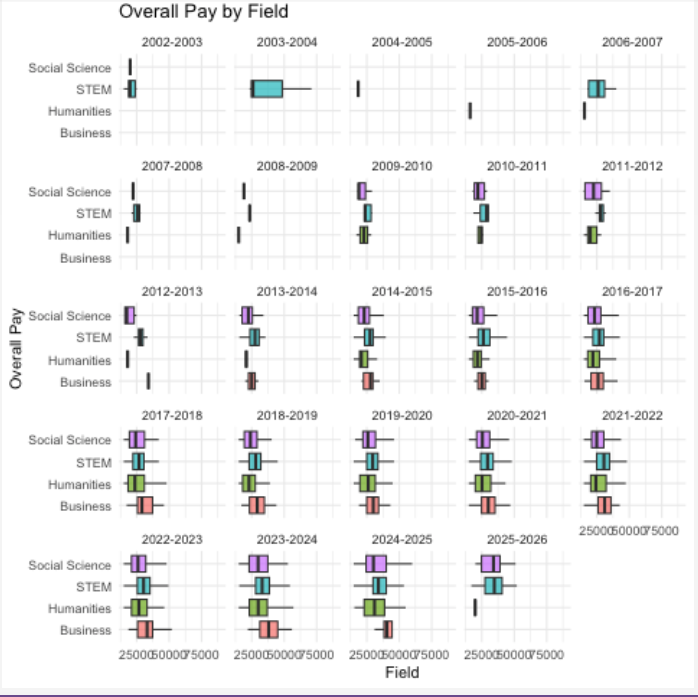

# PhD Candidates in Humanities and Arts are Struggling Financially 
Trump's recent decision to slash funding to research institutions and health systems has sent shockwaves through academia. In response, many universities have been forced to halt new admissions, leaving students and faculty grappling with the fallout. However, the financial struggles for Humanities, Arts, and Social Science phD students date back much earlier, **long before this funding cut**. 

Here is the shortcut to my [article:](https://yatingw24.github.io/phd/)

A great thank to my data sources:
- [PhD Stipends](https://www.phdstipends.com/) for sharing the financial information about PhD students in many disciplines at universities across the US in different academic years.
- [A statistical Report on English PhD Stipends in the US](https://profession.mla.org/english-phd-stipends-in-the-united-states-statistical-report/) for collecting data on stipends for PhD candidates in English conducted between summer 2021 and spring 2022.


## Key Takeaways 
Except for Business PhDs, stipends in other disciplines fall below the 2024 U.S. median cost of living ($3,851/month) and are quickly drained by basic expenses;

Students in Humanities, Arts and Social Sciences can hardly earn a stipend that would catch up with candidates in STEM and Business majors for almost a decade;

A PhD student's stipend is not necessarily tied to their year in the program;

## Questions That This Article Would Answer:
1. What are the reason(s) students in non-STEM disciplines receive fewer stipend? Has this been a trend for a long time before union strikes and even before Covid?
2. What does a Humanity PhD candidate's budget looks like after the deduction of living cost? 
3. Is there a decrease/increase in doctoral enrollments in disciplines such as Humanities, Arts and Social Science in recent years?
4. Are PhD students more or less financially struggling depending on which discipline he chooses?

## What I Did:
### Tech Stack sed:
 - `python - pandas`
 - `R`
 - `regex`
 - `csv`

### A Break Down of Files:
 - `Analysis.ipynb`: the jupyter notebook where I did my majority of data cleaning and analysis.
  - `ggplot_dist.ipynb`: the jupyter notebook where I used R console to generate charts and plots. 
 - `cleaned_output.csv`: the curated dataset after my categorization of majors into four disciplines - Business, Science, Social Science and Humanities. 
 - `debt.csv`: a breakdown of percentage of debt by discipline.
  - `treemap.csv`: a spreadsheet which eventually presented through a treemap that shows the total number of doctoral enrollments in 2024 by discipline. 
 - `phd_stipends.csv`: the original dataset that contains all financial information about nationalwide stipends across discipines. 
 - static_imgs: charts and graphics you find in my article.
  - `privater.csv` and `public.csv`: data about English PhD stipends in public universities and private universities. 

### Data Cleaning and Analysis 
#### Part I: Understanding the Stipend Gap Between Disciplines
1. Opened `phd_stipends.csv` and dropped all irrelevant, confusing and null entries including NA and Non-English characters 
2. Created a new column that categorizes majors into four primary disciplines: Business, Hard-core Science, Social Science and Humanities and Arts. For Humanities, here is a sample code:
```python
    df.loc[df["Department"].str.contains("A|B|C|...", case=False, na=True), "Field"] = "Humanities"
```
3. Set the range of monthly stipend to 15,000 and 90,000 to avoid  outliers. 
4. Describe the statistical summary of monthly stipend for each discipline. Here is a sample code:
```python
df[df['Field'] == "Business"]['Overall Pay'].describe()

```
#### Part II: Educational Debt by Discipline
1. Calculated the percentage of debted students for each discipline using spreadsheet mathematic formulas. 

#### Part III: The Comparison Between Stipend Offered by Private and Public Universities
1. Since I'd like to practice data analysis and cleaning in R, I loaded the data in R;
2. Replaced all signs, such as the dollar sign $, and converted the stipend into numeric numbers using `mutate()` function in R. Here is a sample code:

```python 
public %>%
  mutate(
    `Amount_USD` = gsub(",", "", `Amount_USD`),   
    `Amount_USD` = gsub("\\$", "", `Amount_USD`), 
    `Amount_USD` = as.integer(`Amount_USD`)       
  )

  ```
3. Combined the dataframe for private schools and public schools together using `rbind()`.
4. Stacked density plots for each type of university to compared the gap between the median English PhD stipend. 

### Making ggplot!
#### 1st - A Line Chart showing the Growing Stipend Gap Between Disciplines 
1. Converted the `cleaned_output.csv` into a dataframe and make multiple boxplots to the distribution of **median stipend** by discipline and by time. As the statistical summary revealed, each discipline's stipend is more or less normally distributed. Either median and mean could be a fair representation of the overall stipend. 

2. Named a new dataframe called `df_median` grouped by `Academic Year` and `Field`. All data entries are median stipend for a specific major in a specific academic year.
3. Made **a multi-line chart** using `ggplot`, `geom_rect`, `geom_line` and `geom_point`. 
4. A breakdown of chart elements:
- each line: each line representing a discipline;
- x-axis: the academic year;
- y-axis: median stipend in $;
- highlighted area: the pandemic.

#### 2nd - A Vertical Bar Chart Comparing the Percentage of Debted Students in Each Major
1. Loaded the data, `debt.csv` and went straight to making ggplot using `geom_bar`.
2. Given that I'd like to represent the percentage, I need to have the bar background go to 100%. As a result, I required `library(scales)` and set my my x-axis' scale from 0 to 1.
3. Colored each major accordingly to the disciple each belongs to and made sure the title matches the color-coding as well. 
4. a breakdown of chart elements:
- x-axis: the percentage of debted students;
- y-axis: each bar is a major;
5. In case you are curious why I chose percentage as the scale - it would be unfair to represent the number here since the amount of enrollments in STEM almost tripled over that of Non-Science majors.

#### 3rd - A Treemap About the Amount of PhD Candidates by Discipline
1. Loaded the data, `cleaned_output.csv`, and required `library(treemapify)` to enable the treemap graphing function;
2. 

### Skills Newly Acquired
1. Data analysis is not only done in Python/Pandas, but also in R using a variety of graphing functions such as `geom_bar()`, `geom_treemap()`.
2. Widened my choices of chart types to better convey the message with the most effective type.
3. Acquired more R functions in selecting, filtering, grouping, summarizng data.

## Limitations & Things I'd Like to Improve
1. This is a data-driven project done with a limited amount of time - 
2. 
3. 
 
